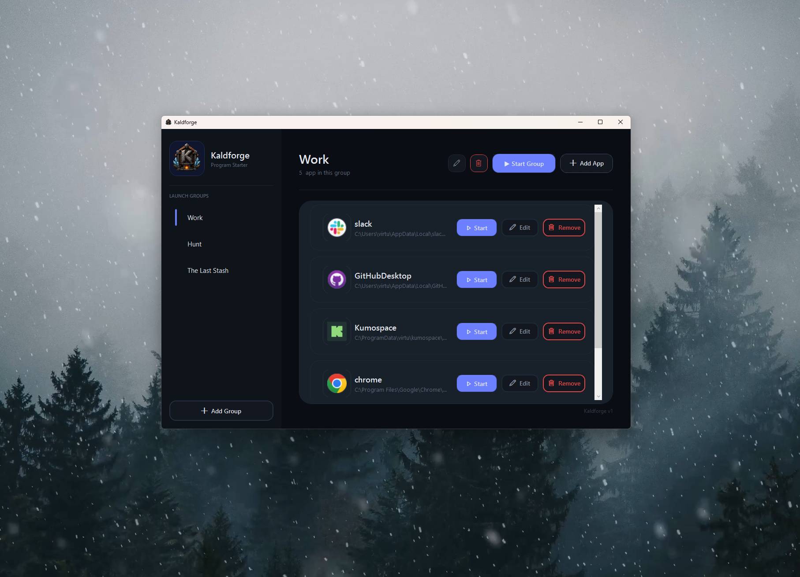

# Kaldforge

**One-click Windows workspace launcher.**

Kaldforge is a small Windows desktop app for creating launch groups and starting your workspace faster. Add your apps once, organize them into groups, then launch a single app or an entire group with one click.

> Built for people who open the same tools every day and are tired of hunting through shortcuts.

---

## Download

**Latest release:**
https://github.com/EthemKrg/Program-Starter/releases/tag/v1.0.0

Download:

```text
KaldforgeSetup_v1.0.0.exe
```

Then run the installer and launch Kaldforge from the Start Menu or desktop shortcut.

---

## Screenshot



---

## Features

* Create custom launch groups
* Add, edit, and remove apps
* Start a single app
* Start all apps in a selected group
* Local-first configuration
* No account required
* Windows installer included
* Premium dark desktop UI

---

## Why Kaldforge?

Most people start their work session by opening the same set of apps again and again.

Kaldforge lets you build launch groups like:

```text
Work
- Chrome
- Slack
- Unity Hub
- GitHub Desktop

Game Dev
- Unity
- Visual Studio
- Blender
- Steam
```

Then you can start the group with one click.

---

## Installation

1. Go to the latest release page:
   https://github.com/EthemKrg/Program-Starter/releases/tag/v1.0.0

2. Download:

   ```text
   KaldforgeSetup_v1.0.0.exe
   ```

3. Run the installer.

4. Open Kaldforge from the Start Menu or desktop shortcut.

---

## Windows SmartScreen Note

Kaldforge is currently not code-signed.

Because of that, Windows SmartScreen may show a warning when running the installer for the first time.

To continue:

```text
More info → Run anyway
```

This warning appears because the installer is unsigned, not because the app is doing anything unusual.

---

## Tech Stack

* C#
* .NET
* WPF
* Windows desktop

---

## Data & Privacy

Kaldforge stores your app groups locally on your computer.

* No account required
* No cloud sync
* No telemetry
* No tracking
* No ads

Your configuration is stored locally under your Windows user profile.

---

## Current Version

```text
v1.0.0
```

First public release.

---

## Roadmap

Possible future improvements:

* Better app icon handling
* Drag and drop app adding
* Launch delay controls
* Import/export groups
* Startup launch options
* More UI polish
* Auto-update support

---

## Feedback

Found a bug or have an idea?

Open an issue here:

https://github.com/EthemKrg/Program-Starter/issues

---

## License

License not selected yet.

Until a license is added, all rights are reserved by the author.
